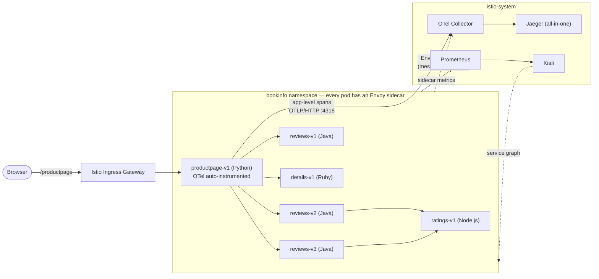

# Istio + OpenTelemetry + Jaeger + Kiali

A full observability stack on top of Istio's `bookinfo` sample app (Python, Ruby, Java, Node.js — multi-language on purpose), deployed and verified end-to-end on minikube. Includes root-causing and fixing a real bug where `productpage`'s app-level OpenTelemetry spans never joined the Envoy-level trace.

**Start here:** [istio-deployment/Minikube_Deployment_Testing_Runbook.md](istio-deployment/Minikube_Deployment_Testing_Runbook.md) — every command run as-is, in order, including the trace-join bug and its fix (§8.6) and a canary rollout verified visually in Kiali (§11).

**Diagram:** [istio-deployment/trace-join-pipeline.html](istio-deployment/trace-join-pipeline.html) visualizes the exact request/telemetry path and the trace-propagation bug/fix.

## Architecture

Both trace sources land in Jaeger under one shared `TraceId` once the `productpage.py` fix (§8.6 in the runbook) is applied — before the fix, the app-level and Envoy-level spans showed up as two disconnected traces.
